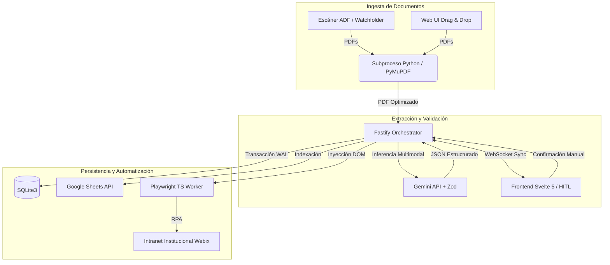

# Oficialia-Digital-DSA

> **Middleware de Ingesta, Extracción IA y RPA para Gestión Documental**


---

## 2. System Overview & Architectural Blueprint

**Oficialia-Digital-DSA** es un sistema intermedio de alto rendimiento enfocado en optimizar el flujo de captura de correspondencia de la División de Servicios Administrativos (DSA) del Hospital Civil de Guadalajara. Actúa como puente operativo para automatizar la recepción de oficios, extraer datos estructurados mediante IA multimodal y efectuar la inyección asíncrona de información hacia sistemas institucionales legados (Webix) a través de Automatización Robótica de Procesos (RPA), requiriendo mínima validación humana (HitL).

### Diagrama de Arquitectura



## 3. Core Modules & Directory Map

El sistema adopta un patrón de **Monolito Modular** y se administra mediante *npm workspaces*, consolidando orquestación y presentación.

| Módulo / Directorio | Responsabilidad de Dominio |
| :--- | :--- |
| `backend/` | Orquestador principal (Fastify) implementado bajo *Clean Architecture*. Contiene contratos, casos de uso e infraestructura (RPA, IA, DB). |
| `frontend/` | Interfaz de validación *Split-Screen Human-in-the-Loop* (Svelte 5) asistida por WebSockets. |
| `docs/` | Fuente de verdad conceptual. Alberga PRD, especificación de tipos, diccionario de datos y prompts del sistema. |
| `storage/` | Watchfolder del ciclo de vida físico de los archivos (estados de entrada, procesamiento, salida y error). |
| `rpa/` | Volcados DOM e insumos estructurales para el mapeo del Worker RPA (Playwright). |

## 4. Tech Stack & Standards

| Categoría | Tecnología y Herramientas |
| :--- | :--- |
| **Runtime & Lenguaje** | Node.js (>=22 LTS), TypeScript (5.7), Python 3 (CLI Worker) |
| **Frameworks Core** | Fastify (Backend), Svelte 5 + Vite (Frontend) |
| **Persistencia** | SQLite3 (`better-sqlite3` en modo WAL), Local File System |
| **Inferencia & IA** | Gemini API (`gemini-2.5-flash`), SDK `@google/genai` |
| **Integración & RPA** | Playwright, Google Sheets API v4 |
| **Validación de Datos**| Zod (Validación estricta de esquemas I/O) |
| **Observabilidad** | Pino, Pino-Pretty (Logging estructurado) |
| **Testing** | Vitest (Pruebas backend), Svelte-Check (Análisis estático UI) |

## 5. Getting Started & Local Development

### Prerequisites

* Node.js `>= 22.0.0`
* Python `3.10+` (con librerías `PyMuPDF` y `Pillow` instaladas localmente)
* Variables de entorno configuradas (`.env` requerido basado en la especificación de `.env.example`)

### Installation & Build

```bash
# 1. Instalar dependencias del monorepo
npm install

# 2. Instalar binarios de navegadores para el Worker RPA
npm run rpa:install-browsers --workspace=backend

# 3. Compilar los módulos de backend y frontend
npm run build:backend
npm run build --workspace=frontend
```

### Run & Debug

Ejecución de perfiles de desarrollo (Terminales concurrentes recomendadas):

```bash
# Terminal 1: Iniciar el backend con hot-reload (TSX)
npm run dev:backend

# Terminal 2: Iniciar el frontend (Vite Preview/Dev)
npm run dev --workspace=frontend
```

## 6. Testing & Quality Assurance

La calidad de software se garantiza mediante análisis estático estricto y ejecución de pruebas unitarias sobre los casos de uso.

```bash
# Ejecutar verificación de tipos y linter estático (Svelte + TS)
npm run typecheck

# Ejecutar suite de pruebas unitarias y de integración (Vitest)
npm run test --workspace=backend
```

## 7. Deployment & CI/CD

El despliegue está diseñado para infraestructuras *On-Premises* (LAN hospitalaria / VPN). Carece de exposición a internet pública por seguridad de datos.

1. **Compilación de Artefactos:** Construir los estáticos de `frontend/` y transpilar `backend/` hacia el directorio `dist/`.
2. **Ejecución de Servicios:** Ejecutar `node dist/presentation/server.js` gestionado por un daemon (e.g., `systemd` o `pm2`).
3. **Persistencia de Archivos:** El árbol de directorios `storage/01_entrada/` debe compartirse a través del protocolo SMB para permitir la ingesta directa desde escáneres departamentales.

## 8. API / Interface Reference

### Contrato de Extracción Core (`MetadatosOficio`)

El orquestador de inferencia utiliza el siguiente contrato de datos (Zod schema en TypeScript) para validar los resultados extraídos por la IA y alimentar la automatización RPA:

```typescript
{
  "numero_oficio": "string // Folio extraído y sanitizado",
  "fecha_emision": "string // Formato YYYY-MM-DD",
  "procedencia": "enum // 'HCG' o 'Ajena'",
  "dependencia_area": "string // Mayúsculas normalizadas",
  "remitente_nombre": "string",
  "remitente_cargo": "string",
  "destinatario_nombre": "string",
  "destinatario_cargo": "string",
  "asunto": "string // Síntesis continua de 1 a 3 oraciones",
  "plazo_dias": "number | null // 0 si no aplica",
  "contiene_datos_sensibles": "boolean // Flag identificador"
}
```

## 9. Engineering Guidelines & Contributing

* **Sincronización de Documentación (Docs-First):** Cualquier alteración a contratos de dominio, diccionarios de datos o modelos de estados debe actualizarse obligatoriamente primero en los artefactos de diseño (`docs/prd.md`, `docs/types.md`) antes del código fuente.
* **Patrones Arquitectónicos:** Todo nuevo caso de uso backend debe inyectarse siguiendo directrices de *Clean Architecture* establecidas en el directorio `src/contracts`.
* **Políticas de Repositorio:** El repositorio aplica políticas estrictas de *Conventional Commits*. Las desviaciones semánticas deberán resolverse en el proceso de Pull Request.

## 10. License & Maintenance

* **Licencia:** Propietaria / Uso Interno Restringido.
* **Mantenimiento y Gobernanza:** Propiedad intelectual de la División de Servicios Administrativos (DSA) del Hospital Civil de Guadalajara. Mantenimiento y control operativo a cargo del equipo de Arquitectura de Software Institucional. Prohibida su divulgación o implementación externa.
