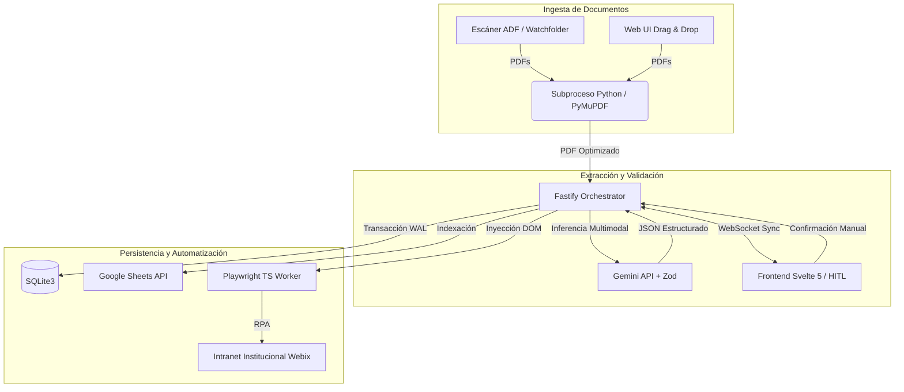

# Oficialia-Digital-DSA

> **Middleware de Ingesta, Extracción IA y RPA para Gestión Documental**


---

## 2. System Overview & Architectural Blueprint

**Oficialia-Digital-DSA** es un sistema intermedio de alto rendimiento enfocado en optimizar el flujo de captura de correspondencia de la División de Servicios Administrativos (DSA) del Hospital Civil de Guadalajara. Actúa como puente operativo para automatizar la recepción de oficios, extraer datos estructurados mediante IA multimodal y efectuar la inyección asíncrona de información hacia sistemas institucionales legados (Webix) a través de Automatización Robótica de Procesos (RPA), requiriendo mínima validación humana (HitL).

### Diagrama de Arquitectura



## 3. Core Modules & Directory Map

El sistema adopta un patrón de **Monolito Modular** y se administra mediante *npm workspaces*, consolidando orquestación y presentación.

| Módulo / Directorio | Responsabilidad de Dominio |
| :--- | :--- |
| `backend/` | Orquestador principal (Fastify) implementado bajo *Clean Architecture*. Contiene contratos, casos de uso e infraestructura (RPA, IA, DB). |
| `frontend/` | Interfaz de validación *Split-Screen Human-in-the-Loop* (Svelte 5) asistida por WebSockets. |
| `docs/` | Fuente de verdad conceptual. Alberga PRD, especificación de tipos, diccionario de datos y prompts del sistema. |
| `storage/` | Watchfolder del ciclo de vida físico de los archivos (estados de entrada, procesamiento, salida y error). |
| `rpa/` | Volcados DOM e insumos estructurales para el mapeo del Worker RPA (Playwright). |
```
backend/src/
├── contracts/        Puertos secundarios + tipos de dominio (fuente de verdad, ver docs/types.md y docs/contracts.md)
├── application/       DocumentWorkflowOrchestrator — casos de uso, sin detalles de infraestructura
├── infrastructure/    Adaptadores concretos de cada puerto (ai, pdf, storage, persistence, rpa, semantic, sync)
└── presentation/       Servidor Fastify, rutas HTTP, WebSocket — composition root (DI manual)
```

| Puerto (`contracts/`) | Adaptador (`infrastructure/`) | Estado |
| --- | --- | --- |
| `IFileStorageProvider` | `LocalFileStorageAdapter` (fs/promises) | ✅ Real |
| `IDocumentRepository` | `SqliteDocumentRepository` (better-sqlite3, WAL) | ✅ Real |
| `IPdfProcessorProvider` | `PythonPdfProcessorAdapter` (spawn de `scripts/pdf_worker.py`, PyMuPDF/Pillow) | ✅ Real |
| `IAIExtractorProvider` | `GeminiAIExtractorAdapter` (`@google/genai`, Gemini 2.5 Flash) | ✅ Real |
| `IRpaInjectionProvider` | `PlaywrightRpaInjectionAdapter` (default) / `PlaywrightRpaAdapter` (`RPA_MODE=playwright`) | ✅ Real, detrás de flag — ver más abajo |
| `IExternalSyncProvider` | `GoogleSheetsExternalSyncAdapter` (`googleapis`, Sheets API v4) | ✅ Real, sin credenciales por default — ver más abajo |
| `ILocalSemanticProvider` (P1) | `LocalSemanticMatcherAdapter` (`@xenova/transformers`, `Xenova/bge-m3`) | ✅ Real, cableado — ver más abajo |

**Google Sheets**: `GoogleSheetsExternalSyncAdapter` es una implementación real (Service
Account + Sheets API v4), pero se entrega sin credenciales configuradas — sin
`GOOGLE_SHEETS_SPREADSHEET_ID` en `.env`, `configured` queda en `false` y cada método de
escritura lanza `ExternalSyncNotConfiguredError` (mismo comportamiento honesto que el
placeholder original: el orquestador ya trata eso como no bloqueante — el documento se
completa igual, solo queda marcado como pendiente de sincronizar). Para activarlo: agrega
`GOOGLE_SHEETS_SPREADSHEET_ID` y, o bien `GOOGLE_SERVICE_ACCOUNT_JSON` (el JSON de la
Service Account en una línea) o `GOOGLE_APPLICATION_CREDENTIALS` apuntando al archivo —
ver `.env.example` y el docstring de `GoogleSheetsExternalSyncAdapter.ts` para el layout
de columnas y los permisos requeridos (Editor sobre la hoja, compartida con el
`client_email` de la Service Account).

**RPA**: `presentation/server.ts` cablea `PlaywrightRpaInjectionAdapter` por defecto — un
stub honesto que nunca lanza un navegador y reporta `checkIntranetHealth() === false`.
`backend/src/infrastructure/rpa/PlaywrightRpaAdapter.ts` es la automatización real contra
`op_cucs.fwx` (selectores Webix mapeados desde `docs/rpa/webix_dump_for_qwen.json`); se
activa con `RPA_MODE=playwright` en `.env` (ver `.env.example`), tras
`npm run rpa:install-browsers` (Chromium de Playwright) y las credenciales/CVEs
institucionales. No ha sido validada contra la Intranet real — revisar selectores y
campos antes de usarla en producción.

**Ingesta Dual — watchfolder real (prd.md §2.1)**: `infrastructure/watcher/IncomingFolderWatcher.ts`
vigila `storage/01_entrada/` por polling (no `fs.watch`/inotify: no es confiable sobre el
volumen SMB que este mismo directorio puede montar desde el escáner departamental) y
dispara `ingestAndExtract` con `origen: 'SCANNER_ADF'` automáticamente — antes, ese valor
de `IngestaOrigen` solo existía como parámetro de query del endpoint HTTP, sin ningún
proceso observando la carpeta. Se activa siempre que `WATCHFOLDER_ENABLED=true` (default;
ver `.env.example`).

**Búsqueda semántica local (Puerto 7, P1)**: `docs/prd.md` §2.2 la incluye como Fase
Complementaria — sugiere al capturista oficios relacionados por similitud semántica
(dependencia + remitente + asunto), complementando el match exacto por folio/hash. El
puerto vive en `backend/src/contracts/ILocalSemanticProvider.ts` (igual que los otros
6); su adaptador (`infrastructure/semantic/LocalSemanticMatcherAdapter.ts`, sobre
`@xenova/transformers` y `Xenova/bge-m3` cuantizado) se cablea siempre en
`server.ts`, reutilizando la misma conexión SQLite que `SqliteDocumentRepository`
(`embeddings_schema.sql` se ejecuta junto a `schema.sql`). Instanciarlo es barato: el
modelo ONNX (~cientos de MB) solo se descarga/carga de forma perezosa en la primera
indexación o búsqueda real, nunca al arrancar el servidor. Indexación: automática y en
segundo plano tras cada confirmación HITL (un fallo de inferencia local nunca bloquea
RPA/Sheets). Búsqueda: `GET /documents/:id/related` — nunca lanza error si el modelo
aún no está listo, degrada a `documentos: []` con `modeloEstado` explícito.

### `frontend/src/`

## 4. Tech Stack & Standards

| Categoría | Tecnología y Herramientas |
| :--- | :--- |
| **Runtime & Lenguaje** | Node.js (>=22 LTS), TypeScript (5.7), Python 3 (CLI Worker) |
| **Frameworks Core** | Fastify (Backend), Svelte 5 + Vite (Frontend) |
| **Persistencia** | SQLite3 (`better-sqlite3` en modo WAL), Local File System |
| **Inferencia & IA** | Gemini API (`gemini-2.5-flash`), SDK `@google/genai` |
| **Integración & RPA** | Playwright, Google Sheets API v4 |
| **Validación de Datos**| Zod (Validación estricta de esquemas I/O) |
| **Observabilidad** | Pino, Pino-Pretty (Logging estructurado) |
| **Testing** | Vitest (Pruebas backend), Svelte-Check (Análisis estático UI) |

## 5. Getting Started & Local Development

### Prerequisites

* Node.js `>= 22.0.0`
* Python `3.10+` (con librerías `PyMuPDF` y `Pillow` — versiones fijadas en `backend/scripts/requirements.txt`)
* Variables de entorno configuradas (`.env` requerido basado en la especificación de `.env.example`)

### Installation & Build

```bash
# 1. Instalar dependencias del monorepo
npm install

# 2. Instalar dependencias Python del worker de preprocesamiento (venv recomendado)
python3 -m venv backend/.venv
source backend/.venv/bin/activate
pip install -r backend/scripts/requirements.txt

# 3. Instalar binarios de navegadores para el Worker RPA
npm run rpa:install-browsers --workspace=backend

# 4. Compilar los módulos de backend y frontend
npm run build:backend
npm run build --workspace=frontend
```

### Run & Debug

Ejecución de perfiles de desarrollo (Terminales concurrentes recomendadas):

```bash
# Terminal 1: Iniciar el backend con hot-reload (TSX)
npm run dev:backend

# Terminal 2: Iniciar el frontend (Vite Preview/Dev)
npm run dev --workspace=frontend
```

## 6. Testing & Quality Assurance

La calidad de software se garantiza mediante análisis estático estricto (ESLint +
Prettier + `tsc`/`svelte-check`) y pruebas unitarias/de integración (Vitest) — todo
corre en CI (`.github/workflows/ci.yml`) en cada push/PR, en cuatro jobs paralelos.

```bash
# Verificación de tipos (Svelte + TS)
npm run typecheck

# Linter (ESLint, flat config compartida backend+frontend — ver eslint.config.mjs)
npm run lint          # npm run lint:fix para autocorregir lo que se pueda

# Formato (Prettier)
npm run format:check  # npm run format para reescribir en sitio

# Suite de pruebas del backend (Vitest) — capa de aplicación, rutas HTTP (fastify.inject),
# storage (fs real sobre directorio temporal), watchfolder y adaptador de Google Sheets
# (todos con fakes/fs real, nunca mocks de red real)
npm run test --workspace=backend
```

## 7. Deployment & CI/CD

El despliegue está diseñado para infraestructuras *On-Premises* (LAN hospitalaria / VPN). Carece de exposición a internet pública por seguridad de datos.

**Opción A — Docker** (`backend/Dockerfile`, `frontend/Dockerfile`, contexto de build =
raíz del monorepo; ver el docstring de cada Dockerfile para las opciones de build):

```bash
docker build -f backend/Dockerfile -t oficialia-backend .
docker build -f frontend/Dockerfile --build-arg VITE_API_BASE_URL=http://<backend-host>:3000 -t oficialia-frontend .
```

**Opción B — proceso Node/Python directo** (systemd/pm2):

1. **Compilación de Artefactos:** Construir los estáticos de `frontend/` y transpilar `backend/` hacia el directorio `dist/` (`npm run build:backend` también copia `schema.sql`/`embeddings_schema.sql` a `dist/` — ver `backend/scripts/copy-build-assets.js`; sin eso, `node dist/presentation/server.js` crashea al arrancar).
2. **Ejecución de Servicios:** Ejecutar `node dist/presentation/server.js` gestionado por un daemon (e.g., `systemd` o `pm2`).
3. **Persistencia de Archivos:** El árbol de directorios `storage/01_entrada/` debe compartirse a través del protocolo SMB para permitir la ingesta directa desde escáneres departamentales — `IncomingFolderWatcher` lo vigila por polling (ver §3).

**CI**: `.github/workflows/ci.yml` corre `typecheck`/`test`/`lint` (backend), `svelte-check`
(frontend), `format:check` (Prettier) y un smoke test del worker Python (instala
`requirements.txt` en un venv limpio y ejecuta `pdf_worker.py inspect` sobre un PDF
generado en el momento) en cada push/PR.

## 8. API / Interface Reference

### Contrato de Extracción Core (`MetadatosOficio`)

El orquestador de inferencia utiliza el siguiente contrato de datos (Zod schema en TypeScript) para validar los resultados extraídos por la IA y alimentar la automatización RPA:

```typescript
{
  "numero_oficio": "string // Folio extraído y sanitizado",
  "fecha_emision": "string // Formato YYYY-MM-DD",
  "procedencia": "enum // 'HCG' o 'Ajena'",
  "dependencia_area": "string // Mayúsculas normalizadas",
  "remitente_nombre": "string",
  "remitente_cargo": "string",
  "destinatario_nombre": "string",
  "destinatario_cargo": "string",
  "asunto": "string // Síntesis continua de 1 a 3 oraciones",
  "plazo_dias": "number | null // 0 si no aplica",
  "contiene_datos_sensibles": "boolean // Flag identificador"
}
```

## 9. Engineering Guidelines & Contributing

* **Sincronización de Documentación (Docs-First):** Cualquier alteración a contratos de dominio, diccionarios de datos o modelos de estados debe actualizarse obligatoriamente primero en los artefactos de diseño (`docs/prd.md`, `docs/types.md`) antes del código fuente.
* **Patrones Arquitectónicos:** Todo nuevo caso de uso backend debe inyectarse siguiendo directrices de *Clean Architecture* establecidas en el directorio `src/contracts`.
* **Políticas de Repositorio:** El repositorio aplica políticas estrictas de *Conventional Commits*. Las desviaciones semánticas deberán resolverse en el proceso de Pull Request.

## 10. License & Maintenance

* **Licencia:** Propietaria / Uso Interno Restringido.
* **Mantenimiento y Gobernanza:** Propiedad intelectual de la División de Servicios Administrativos (DSA) del Hospital Civil de Guadalajara. Mantenimiento y control operativo a cargo del equipo de Arquitectura de Software Institucional. Prohibida su divulgación o implementación externa.
Ver [`docs/README.md`](./docs/README.md) — PRD, contratos de los 7 puertos, modelo de
dominio y el system prompt de extracción, junto con la tabla de qué archivo de código
implementa cada uno.
