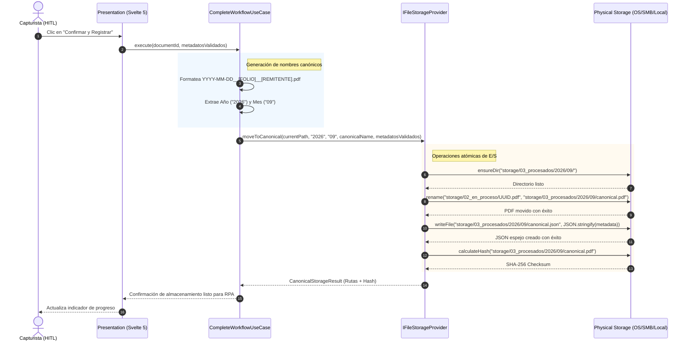
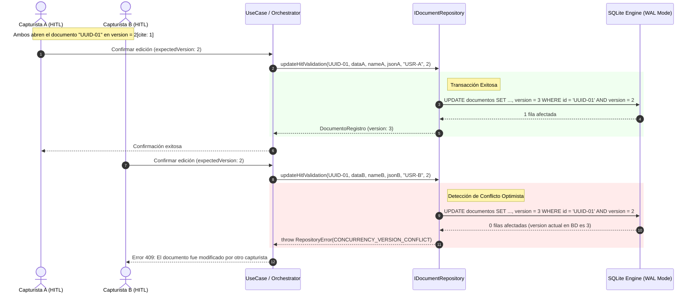
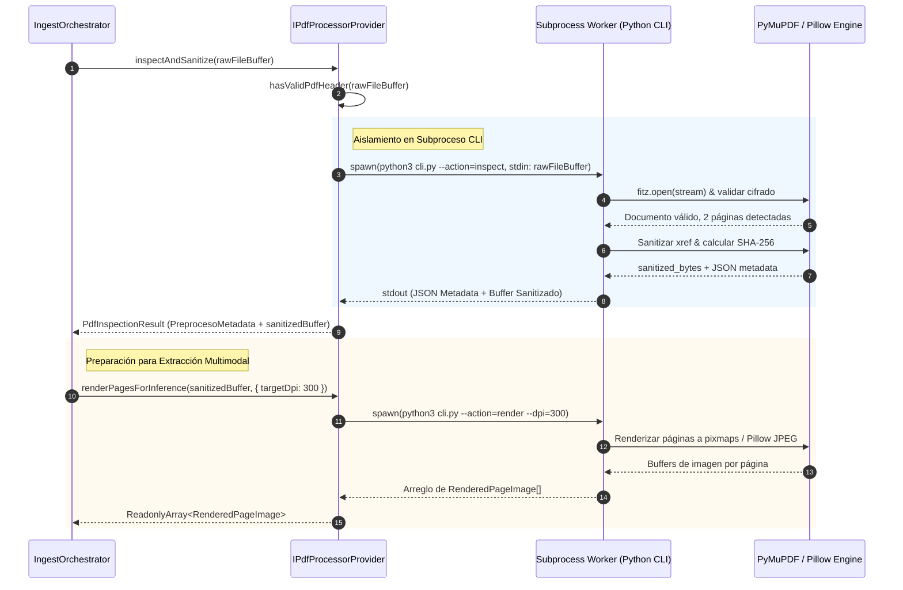
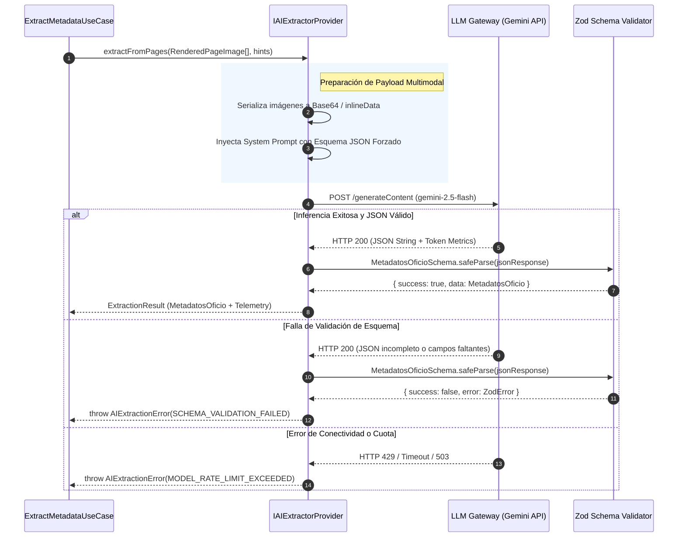
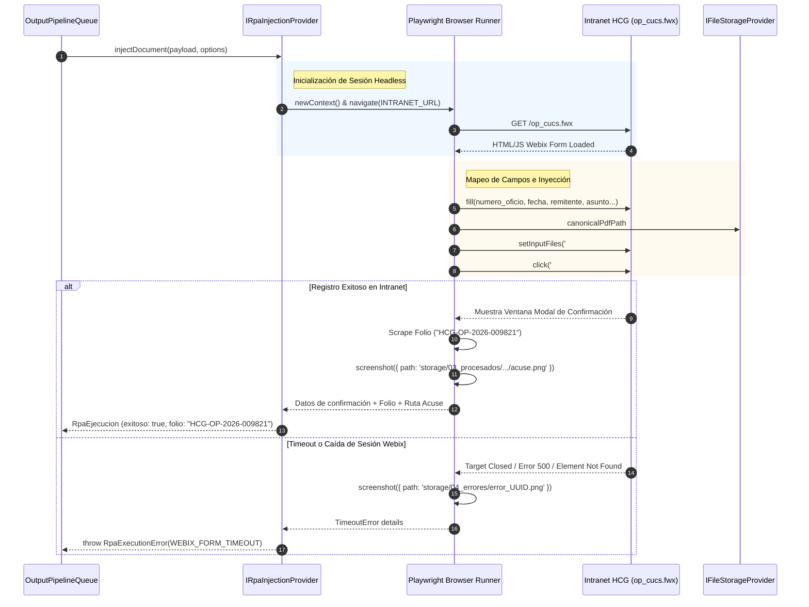
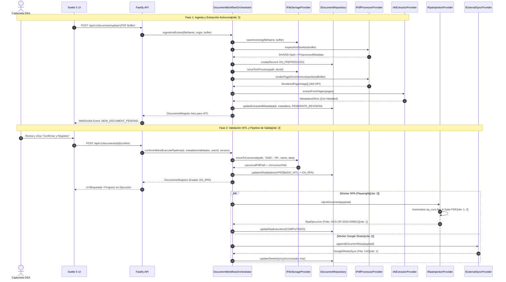

### 1. Definición de Interfaz (TypeScript)

```typescript
/**
 * SISTEMA OFICIALIA-DIGITAL-DSA
 * Contrato de Abstracción de Almacenamiento de Archivos (Puerto Secundario)
 * Versión: 1.0.0-MVP
 */

import type { MetadatosOficio } from './types';

/**
 * Errores tipados específicos de operaciones de almacenamiento.
 * Permiten a los orquestadores manejar excepciones de E/S sin conocer el driver subyacente.
 */
export type StorageErrorCode =
  | 'FILE_NOT_FOUND'
  | 'FILE_ALREADY_EXISTS'
  | 'INVALID_FILE_NAME'
  | 'STORAGE_PERMISSION_DENIED'
  | 'DIRECTORY_CREATION_FAILED'
  | 'MIRROR_JSON_WRITE_FAILED'
  | 'STORAGE_QUOTA_EXCEEDED';

/**
 * Representación estructurada de un fallo en la capa de almacenamiento.
 */
export interface StorageError {
  code: StorageErrorCode;
  message: string;
  targetPath?: string;
  cause?: unknown;
}

/**
 * Resultado inmutable tras la consolidación canónica en la fase final de salida.
 */
export interface CanonicalStorageResult {
  /** Ruta o URI final del archivo PDF estructurado */
  canonicalPdfPath: string;
  /** Ruta o URI del archivo JSON espejo con metadatos */
  mirrorJsonPath: string;
  /** Checksum SHA-256 verificado en la ubicación final */
  sha256Hash: string;
}

/**
 * Etapas del pipeline de almacenamiento documental.
 */
export type StorageStage = '01_entrada' | '02_en_proceso' | '03_procesados' | '04_errores';

/**
 * Descripción del Contrato: IFileStorageProvider
 * Propósito: Aislar el sistema de archivos local (storage/) y permitir la interoperabilidad 
 * con volúmenes de red SMB, buckets de nube o discos locales sin impactar la lógica de negocio.
 */
export interface IFileStorageProvider {
  /**
   * Guarda un archivo recibido en la zona de ingesta temporal.
   * 
   * @param fileName Nombre original del archivo.
   * @param content Buffer binario del documento.
   * @returns Ruta relativa o identificador persistido en storage/01_entrada/.
   * @throws {StorageError} Si el buffer está vacío o no hay permisos de escritura.
   * @sideEffect Escribe físicamente en el disco o volumen montado.
   */
  saveIncoming(fileName: string, content: Uint8Array): Promise<string>;

  /**
   * Mueve un archivo desde la zona de ingesta hacia la zona de trabajo bloqueado.
   * 
   * @param relativeSourcePath Ruta actual del documento (ej. storage/01_entrada/archivo.pdf).
   * @param targetIdentifier Identificador único para renombrado en proceso (UUID).
   * @returns Ruta de bloqueo dentro de storage/02_en_proceso/.
   * @throws {StorageError} Si el archivo fuente no existe o está bloqueado por el SO.
   * @performance Operación atómica (rename / link) para evitar transferencias completas en disco.
   */
  moveToInProcess(relativeSourcePath: string, targetIdentifier: string): Promise<string>;

  /**
   * Consolida el documento en el repositorio cronológico canónico y genera el archivo JSON espejo.
   * 
   * @param currentPath Ruta del archivo en proceso (storage/02_en_proceso/UUID.pdf).
   * @param year Año calendario para la estructura de carpetas (ej. "2026").
   * @param month Mes calendario para la estructura de carpetas (ej. "09").
   * @param canonicalFileName Nombre normalizado: YYYY-MM-DD__[FOLIO]__[REMITENTE].pdf.
   * @param metadata Objeto inmutable con los metadatos validados en HITL para el JSON espejo.
   * @returns Estructura con las rutas definitivas del PDF y del JSON espejo generado.
   * @sideEffect Crea directorios YYYY/MM recursivamente y escribe el archivo .json adjunto.
   */
  moveToCanonical(
    currentPath: string,
    year: string,
    month: string,
    canonicalFileName: string,
    metadata: Readonly<MetadatosOficio>
  ): Promise<CanonicalStorageResult>;

  /**
   * Mueve un documento con errores críticos o fallos irrecuperables a la carpeta de aislamiento.
   * 
   * @param currentPath Ubicación del documento fallido.
   * @param reason Motivo del fallo o código de error para trazabilidad.
   * @returns Ruta dentro de storage/04_errores/.
   * @sideEffect Mueve el archivo y previene reprocesamientos accidentales.
   */
  moveToError(currentPath: string, reason: string): Promise<string>;

  /**
   * Obtiene los bytes de un archivo dado su identificador o ruta.
   * 
   * @param relativePath Ubicación del archivo en el storage.
   * @returns Buffer en memoria del archivo solicitado.
   * @throws {StorageError} Con código FILE_NOT_FOUND si el recurso no existe.
   * @performance Puede retornar streams en implementaciones avanzadas para archivos pesados.
   */
  readFile(relativePath: string): Promise<Uint8Array>;

  /**
   * Verifica la existencia física de un recurso en el almacenamiento.
   * 
   * @param relativePath Ubicación a comprobar.
   * @returns `true` si el archivo existe y es legible, `false` en caso contrario.
   */
  exists(relativePath: string): Promise<boolean>;
}

```

---

### 2. Flujo Lógico (Mermaid)

El siguiente diagrama detalla la interacción entre el caso de uso de finalización documental, el proveedor de almacenamiento `IFileStorageProvider` y el sistema físico de archivos durante la etapa de consolidación canónica y creación del espejo JSON.



---

### 1. Definición de Interfaz (TypeScript)

```typescript
/**
 * SISTEMA OFICIALIA-DIGITAL-DSA
 * Contrato de Repositorio de Persistencia Documental (Puerto Secundario)
 * Versión: 1.0.0-MVP
 */

import type { 
  DocumentoRegistro, 
  DocumentoEstado, 
  MetadatosOficio, 
  PreprocesoMetadata, 
  RpaEjecucion, 
  GoogleSheetsSync 
} from './types';

/**
 * Errores controlados de la capa de persistencia.
 * Desacoplan las excepciones SQL/ORM del dominio.
 */
export type RepositoryErrorCode =
  | 'DOCUMENT_NOT_FOUND'
  | 'DUPLICATE_DOCUMENT_HASH'
  | 'DUPLICATE_FOLIO_REGISTERED'
  | 'CONCURRENCY_VERSION_CONFLICT'
  | 'PERSISTENCE_TRANSACTION_FAILED'
  | 'DATABASE_BUSY_TIMEOUT';

/**
 * Estructura de error especializada para persistencia.
 */
export interface RepositoryError {
  code: RepositoryErrorCode;
  message: string;
  documentId?: string;
  currentVersion?: number;
  expectedVersion?: number;
  cause?: unknown;
}

/**
 * Filtros de consulta agnósticos para indexación y bandejas de trabajo.
 */
export interface DocumentQueryFilters {
  /** Filtrado por estado transaccional */
  estado?: DocumentoEstado;
  /** Filtrado por múltiples estados simultáneos */
  estados?: DocumentoEstado[];
  /** Filtrado por emisor o procedencia */
  procedencia?: 'HCG' | 'Ajena';
  /** Búsqueda por folio de oficio */
  numeroOficio?: string;
  /** Rango de fechas de ingesta (ISO 8601) */
  fechaDesde?: string;
  fechaHasta?: string;
  /** Paginación */
  limit?: number;
  offset?: number;
}

/**
 * DTO para la creación inicial de un registro documental.
 */
export type CreateDocumentRecordDTO = Omit<
  DocumentoRegistro,
  'id' | 'version' | 'updatedAt' | 'fechaIngesta' | 'fechaValidacionHitl' | 'fechaFinalizacion'
>;

/**
 * Descripción del Contrato: IDocumentRepository
 * Propósito: Gestionar el ciclo de vida del estado transaccional de los documentos,
 * garantizando integridad atómica, control de concurrencia optimista y desacoplamiento del motor SQL.
 */
export interface IDocumentRepository {
  
  /**
   * Persiste un nuevo registro documental con control atómico de unicidad por hash.
   * 
   * @param document Datos base de ingesta del documento.
   * @returns Registro persistido con UUID v4, version = 1 y marcas de tiempo inicializadas.
   * @throws {RepositoryError} Con código DUPLICATE_DOCUMENT_HASH si el hash SHA-256 ya existe.
   * @sideEffect Inserta una fila en la base de datos principal.
   */
  create(document: CreateDocumentRecordDTO): Promise<Readonly<DocumentoRegistro>>;

  /**
   * Obtiene un registro por su identificador único (UUID).
   * 
   * @param id Identificador único del registro.
   * @returns El registro documental o `null` si no existe.
   * @performance Búsqueda indexada por Primary Key (O(1)).
   */
  findById(id: string): Promise<Readonly<DocumentoRegistro> | null>;

  /**
   * Busca un documento por su huella criptográfica SHA-256 para prevenir ingestas duplicadas.
   * 
   * @param sha256Hash Checksum de 64 caracteres en formato hexadecimal.
   * @returns El registro coincidente o `null` si es inédito.
   * @performance Búsqueda con índice único en B-Tree.
   */
  findByHash(sha256Hash: string): Promise<Readonly<DocumentoRegistro> | null>;

  /**
   * Busca si un número de oficio ya fue procesado con anterioridad.
   * 
   * @param numeroOficio Folio oficial sanitizado.
   * @returns El registro coincidente o `null`.
   */
  findByFolio(numeroOficio: string): Promise<Readonly<DocumentoRegistro> | null>;

  /**
   * Consulta documentos según filtros específicos (bandejas HITL, reportes, colas de trabajo).
   * 
   * @param filters Criterios de filtrado y paginación.
   * @returns Colección inmutable de documentos ordenados cronológicamente por fechaIngesta.
   */
  findMany(filters: DocumentQueryFilters): Promise<ReadonlyArray<DocumentoRegistro>>;

  /**
   * Actualiza el estado transaccional simple con validación de concurrencia optimista.
   * 
   * @param id Identificador único del documento.
   * @param newStatus Nuevo estado de la máquina de estados.
   * @param expectedVersion Versión esperada del registro antes del cambio.
   * @returns Documento actualizado con version incrementada (+1).
   * @throws {RepositoryError} Con código CONCURRENCY_VERSION_CONFLICT si version != expectedVersion.
   */
  updateStatus(
    id: string, 
    newStatus: DocumentoEstado, 
    expectedVersion: number
  ): Promise<Readonly<DocumentoRegistro>>;

  /**
   * Guarda los metadatos técnicos generados por el worker de preprocesamiento.
   * 
   * @param id Identificador único del documento.
   * @param preprocess Métricas técnicas de PyMuPDF y Pillow.
   * @param nextStatus Estado subsiguiente (ej. PENDIENTE_EXTRACCION).
   * @param expectedVersion Versión esperada para control optimista.
   * @returns Documento actualizado.
   * @throws {RepositoryError} Si ocurre un conflicto de versión.
   */
  updatePreprocessMetadata(
    id: string,
    preprocess: PreprocesoMetadata,
    nextStatus: DocumentoEstado,
    expectedVersion: number
  ): Promise<Readonly<DocumentoRegistro>>;

  /**
   * Almacena los metadatos estructurados inferidos por la IA.
   * 
   * @param id Identificador único del documento.
   * @param extractedMetadata Metadatos obtenidos de la inferencia.
   * @param nextStatus Estado resultante (ej. PENDIENTE_REVISION).
   * @param expectedVersion Versión esperada.
   * @returns Documento actualizado.
   */
  updateExtractedMetadata(
    id: string,
    extractedMetadata: MetadatosOficio,
    nextStatus: DocumentoEstado,
    expectedVersion: number
  ): Promise<Readonly<DocumentoRegistro>>;

  /**
   * Persiste la validación humana (HITL), asignando la nomenclatura canónica y el revisor.
   * 
   * @param id Identificador único del documento.
   * @param validatedMetadata Metadatos definitivos confirmados por el usuario.
   * @param canonicalName Nombre estandarizado YYYY-MM-DD__[FOLIO]__[REMITENTE].pdf.
   * @param mirrorJsonPath Ruta física del archivo JSON espejo.
   * @param userId Identificador del capturista que autorizó la operación.
   * @param expectedVersion Versión esperada.
   * @returns Documento actualizado en estado APROBADO_HITL o EN_RPA.
   * @sideEffect Establece fechaValidacionHitl con timestamp UTC actual.
   */
  updateHitlValidation(
    id: string,
    validatedMetadata: MetadatosOficio,
    canonicalName: string,
    mirrorJsonPath: string,
    userId: string,
    expectedVersion: number
  ): Promise<Readonly<DocumentoRegistro>>;

  /**
   * Registra el resultado de la inyección RPA en la Intranet y consolida el ciclo de vida.
   * 
   * @param id Identificador único del documento.
   * @param rpa Resultado detallado de la automatización Playwright.
   * @param finalStatus Estado final (COMPLETADO o ERROR_RPA).
   * @param expectedVersion Versión esperada.
   * @returns Documento actualizado.
   * @sideEffect Si finalStatus es COMPLETADO, establece fechaFinalizacion.
   */
  updateRpaExecution(
    id: string,
    rpa: RpaEjecucion,
    finalStatus: DocumentoEstado,
    expectedVersion: number
  ): Promise<Readonly<DocumentoRegistro>>;

  /**
   * Actualiza el estado de sincronización hacia el tablero central de control externo.
   * 
   * @param id Identificador único del documento.
   * @param sheetsSync Información de la fila y timestamp de sincronización.
   * @param expectedVersion Versión esperada.
   * @returns Documento actualizado.
   */
  updateSheetsSync(
    id: string,
    sheetsSync: GoogleSheetsSync,
    expectedVersion: number
  ): Promise<Readonly<DocumentoRegistro>>;
}

```

---

### 2. Flujo Lógico (Mermaid)

El siguiente diagrama ilustra una actualización de metadatos con detección y rechazo por conflicto de concurrencia optimista (`CONCURRENCY_VERSION_CONFLICT`), garantizando que dos capturistas no sobrescriban el mismo oficio de forma simultánea.



---

### 1. Definición de Interfaz (TypeScript)

```typescript
/**
 * SISTEMA OFICIALIA-DIGITAL-DSA
 * Contrato de Procesamiento y Sanitización de PDF (Puerto Secundario)
 * Versión: 1.0.0-MVP
 */

import type { PreprocesoMetadata, PaginaDimension } from './types';

/**
 * Errores específicos del motor de procesamiento e inspección de PDFs.
 */
export type PdfProcessingErrorCode =
  | 'CORRUPTED_PDF_STRUCTURE'
  | 'PASSWORD_PROTECTED_FILE'
  | 'ZERO_BYTE_OR_EMPTY_BUFFER'
  | 'RENDERING_EXECUTION_TIMEOUT'
  | 'UNSUPPORTED_DPI_OR_DIMENSIONS'
  | 'SANITIZATION_FAILED'
  | 'WORKER_SUBPROCESS_FAULT';

/**
 * Estructura de error para fallos de preprocesamiento de documentos.
 */
export interface PdfProcessingError {
  code: PdfProcessingErrorCode;
  message: string;
  underlyingExitCode?: number;
  cause?: unknown;
}

/**
 * Opciones de renderizado para optimizar las páginas antes de la inferencia multimodal.
 */
export interface PageRenderOptions {
  /** DPI objetivo para normalizar la resolución (ej. 300 DPI) */
  targetDpi?: number;
  /** Formato de compresión de las imágenes generadas */
  format?: 'image/png' | 'image/jpeg';
  /** Límite superior de páginas a renderizar (evita desbordamiento de memoria) */
  maxPages?: number;
}

/**
 * Representación inmutable de una página renderizada y optimizada en memoria.
 */
export interface RenderedPageImage {
  /** Número de página relativo (1-indexed) */
  pageNumber: number;
  /** Buffer binario de la imagen lista para inferencia */
  imageBuffer: Uint8Array;
  /** Formato MIME de la imagen */
  mimeType: 'image/png' | 'image/jpeg';
  /** Dimensiones reales de la imagen generada */
  widthPx: number;
  heightPx: number;
  /** Densidad resultante */
  dpi: number;
}

/**
 * Resultado completo del proceso de inspección, sanitización y auditoría técnica.
 */
export interface PdfInspectionResult {
  /** Métricas técnicas requeridas por el modelo de dominio */
  metadata: PreprocesoMetadata;
  /** Buffer binario del PDF sanitizado sin streams corruptos */
  sanitizedBuffer: Uint8Array;
}

/**
 * Descripción del Contrato: IPdfProcessorProvider
 * Propósito: Aislar la invocación de herramientas de procesamiento documental de bajo nivel 
 * (PyMuPDF, Pillow, subprocesos CLI), entregando buffers sanitizados e imágenes normalizadas para el LLM.
 */
export interface IPdfProcessorProvider {

  /**
   * Inspecciona la integridad estructural del documento, repara inconsistencias menores,
   * calcula las dimensiones/DPI por página y computa el hash criptográfico SHA-256.
   * 
   * @param rawFileBuffer Buffer binario del archivo original sin procesar.
   * @returns Metadatos técnicos y el buffer sanitizado.
   * @throws {PdfProcessingError} Con PASSWORD_PROTECTED_FILE si el PDF requiere clave.
   * @throws {PdfProcessingError} Con CORRUPTED_PDF_STRUCTURE si el parser no puede reconstruir el árbol xref.
   * @performance Ejecuta validación en memoria y cálculos matemáticos por página.
   * @sideEffect No persiste archivos en disco de forma permanente.
   */
  inspectAndSanitize(rawFileBuffer: Uint8Array): Promise<PdfInspectionResult>;

  /**
   * Renderiza las páginas del documento como imágenes de alta resolución optimizadas
   * para el análisis visual del motor de inferencia multimodal.
   * 
   * @param sanitizedBuffer Buffer del PDF previamente sanitizado.
   * @param options Configuración de DPI y formato de salida.
   * @returns Colección inmutable de buffers de imagen ordenados por número de página.
   * @performance Proceso intensivo de CPU. Se ejecuta en aislamiento para evitar bloqueos del event-loop.
   */
  renderPagesForInference(
    sanitizedBuffer: Uint8Array,
    options?: PageRenderOptions
  ): Promise<ReadonlyArray<RenderedPageImage>>;

  /**
   * Verifica de manera rápida si un buffer binario cumple con la firma de cabecera mágica de un PDF válido (%PDF-).
   * 
   * @param buffer Primeros bytes del archivo para verificación preliminar.
   * @returns `true` si el archivo contiene una cabecera reconocible.
   * @performance Operación síncrona/inmediata O(1).
   */
  hasValidPdfHeader(buffer: Uint8Array): boolean;
}

```

---

### 2. Flujo Lógico (Mermaid)

El siguiente diagrama ilustra el flujo de preprocesamiento, aislamiento del subproceso CLI y transformación del PDF hacia imágenes optimizadas para el pipeline de extracción.



---

### 1. Definición de Interfaz (TypeScript)

```typescript
/**
 * SISTEMA OFICIALIA-DIGITAL-DSA
 * Contrato de Extracción Inteligente de Metadatos por IA (Puerto Secundario)
 * Versión: 1.0.0-MVP
 */

import type { MetadatosOficio } from './types';
import type { RenderedPageImage } from './IPdfProcessorProvider';

/**
 * Errores controlados del motor de inferencia multimodal y validación de esquema.
 */
export type AIExtractionErrorCode =
  | 'MODEL_RATE_LIMIT_EXCEEDED'
  | 'INFERENCE_TIMEOUT'
  | 'SCHEMA_VALIDATION_FAILED'
  | 'SAFETY_CONTENT_BLOCKED'
  | 'MALFORMED_JSON_RESPONSE'
  | 'AI_SERVICE_UNAVAILABLE'
  | 'DOCUMENT_UNREADABLE_OR_EMPTY';

/**
 * Representación estructurada de un fallo durante la fase de extracción por IA.
 */
export interface AIExtractionError {
  code: AIExtractionErrorCode;
  message: string;
  rawResponse?: string;
  validationIssues?: Array<{ path: string; message: string }>;
  cause?: unknown;
}

/**
 * Metadatos contextuales o pistas opcionales para guiar la inferencia sin acoplar el prompt.
 */
export interface ExtractionHints {
  /** Sugerencia de procedencia preliminar si se conoce por el canal de ingesta */
  defaultProcedencia?: 'HCG' | 'Ajena';
  /** Año de contexto de emisión para desambiguar fechas borrosas */
  contextYear?: number;
}

/**
 * Métricas de consumo y latencia de la llamada al motor de inferencia.
 */
export interface ExtractionTelemetry {
  /** Tokens de entrada consumidos (imágenes y texto de sistema) */
  promptTokens: number;
  /** Tokens de salida generados en el JSON */
  completionTokens: number;
  /** Latencia de la solicitud HTTP en milisegundos */
  latencyMs: number;
  /** Identificador del modelo subyacente que resolvió la inferencia */
  modelVersion: string;
}

/**
 * Envoltorio inmutable del resultado de la inferencia junto a su telemetría.
 */
export interface ExtractionResult {
  /** Metadatos estructurados validados contra el contrato estricto de dominio */
  metadata: Readonly<MetadatosOficio>;
  /** Métricas de consumo del modelo */
  telemetry: ExtractionTelemetry;
}

/**
 * Descripción del Contrato: IAIExtractorProvider
 * Propósito: Abstraer el motor de visión e inferencia multimodal (LLM) y la validación de esquemas Zod,
 * permitiendo cambiar el proveedor de IA o actualizar el modelo sin modificar los casos de uso.
 */
export interface IAIExtractorProvider {
  /**
   * Extrae los metadatos de un oficio procesando las imágenes renderizadas de sus páginas.
   * 
   * @param pages Colección de imágenes de alta resolución del documento.
   * @param hints Parámetros opcionales para guiar la interpretación de la IA.
   * @returns Resultado tipado inmutable que cumple con MetadatosOficio y su telemetría.
   * @throws {AIExtractionError} Con SCHEMA_VALIDATION_FAILED si el JSON generado no cumple el esquema Zod.
   * @throws {AIExtractionError} Con MODEL_RATE_LIMIT_EXCEEDED ante saturación de cuota de API.
   * @throws {AIExtractionError} Con INFERENCE_TIMEOUT si la llamada excede el tiempo límite de red.
   * @performance Depende de la latencia de red del proveedor y del número de páginas enviadas.
   * @sideEffect No persiste datos en servidores externos (conexión en tránsito sin retención).
   */
  extractFromPages(
    pages: ReadonlyArray<RenderedPageImage>,
    hints?: ExtractionHints
  ): Promise<ExtractionResult>;

  /**
   * Realiza un diagnóstico de disponibilidad y conectividad con el proveedor de IA.
   * 
   * @returns `true` si el servicio está operativo y cuenta con cuota disponible.
   * @performance Útil para health-checks y circuit breakers en el orquestador.
   */
  ping(): Promise<boolean>;
}

```

---

### 2. Flujo Lógico (Mermaid)

El siguiente diagrama detalla la orquestación entre el caso de uso, el proveedor `IAIExtractorProvider`, la llamada multimodal al LLM y la posterior validación estricta en tiempo de ejecución.



---

### 1. Definición de Interfaz (TypeScript)

```typescript
/**
 * SISTEMA OFICIALIA-DIGITAL-DSA
 * Contrato de Inyección Automatizada y Captura de Acuses (Puerto Secundario)
 * Versión: 1.0.0-MVP
 */

import type { MetadatosOficio, RpaEjecucion } from './types';

/**
 * Errores controlados específicos de la automatización web y navegación en la Intranet.
 */
export type RpaErrorCode =
  | 'INTRANET_AUTH_FAILED'
  | 'SESSION_EXPIRED'
  | 'WEBIX_FORM_TIMEOUT'
  | 'FILE_UPLOAD_FAILED'
  | 'CONFIRMATION_FOLIO_NOT_FOUND'
  | 'TARGET_CLOSED_OR_CRASHED'
  | 'INTRANET_UNREACHABLE_OR_OFFLINE';

/**
 * Representación estructurada de un fallo en la ejecución RPA.
 */
export interface RpaExecutionError {
  code: RpaErrorCode;
  message: string;
  screenshotErrorPath?: string;
  attemptCount: number;
  durationMs: number;
  cause?: unknown;
}

/**
 * Opciones de ejecución y configuración de resiliencia para el worker de automatización.
 */
export interface RpaExecutionOptions {
  /** Límite de tiempo máximo para la sesión completa de automatización en milisegundos */
  timeoutMs?: number;
  /** Cantidad máxima de reintentos automáticos permitidos ante fallas transitorias */
  maxRetries?: number;
  /** Bandera para habilitar ejecución en modo visible (útil para debugging en staging) */
  headless?: boolean;
}

/**
 * Payload requerido para realizar la inyección en el módulo institucional.
 */
export interface RpaInjectionPayload {
  /** Identificador único del documento en el sistema */
  documentId: string;
  /** Metadatos definitivos validados durante la fase HITL */
  metadata: Readonly<MetadatosOficio>;
  /** Ruta física o URI accesible al archivo PDF canónico estandarizado */
  canonicalPdfPath: string;
}

/**
 * Descripción del Contrato: IRpaInjectionProvider
 * Propósito: Abstraer el motor de automatización (Playwright) y la interacción con la interfaz 
 * legacy Webix (op_cucs.fwx), permitiendo inyectar metadatos, adjuntar el archivo y capturar el acuse.
 */
export interface IRpaInjectionProvider {
  /**
   * Inyecta los metadatos de un oficio en el formulario Webix, adjunta el PDF y captura el acuse.
   * 
   * @param payload Datos del documento, metadatos estructurados y ruta del PDF final.
   * @param options Parámetros de timeout, reintentos y configuración del navegador.
   * @returns Resultado inmutable de la ejecución RPA con el folio oficial o detalles del intento.
   * @throws {RpaExecutionError} Si se superan los reintentos o el formulario no responde.
   * @performance Proceso asíncrono intensivo en I/O de red y memoria (gestión de navegador headless).
   * @sideEffect Crea un nuevo registro en la base de datos de la Intranet y guarda la captura del acuse.
   */
  injectDocument(
    payload: RpaInjectionPayload,
    options?: RpaExecutionOptions
  ): Promise<Readonly<RpaEjecucion>>;

  /**
   * Ejecuta un reintento manual de inyección para documentos en estado de error previo.
   * 
   * @param previousExecutionId Identificador UUID de la ejecución RPA previa fallida.
   * @param payload Nuevos datos o reenvío del payload original.
   * @param options Opciones de ejecución.
   * @returns Resultado del nuevo intento con el contador de reintentos incrementado.
   */
  retryInjection(
    previousExecutionId: string,
    payload: RpaInjectionPayload,
    options?: RpaExecutionOptions
  ): Promise<Readonly<RpaEjecucion>>;

  /**
   * Valida la conectividad con la Intranet y el estado de la sesión activa del usuario institucional.
   * 
   * @returns `true` si el portal Webix responde y la autenticación es válida.
   * @performance Llamada ligera para health-checks y prevención de fallos antes de encolar.
   */
  checkIntranetHealth(): Promise<boolean>;
}

```

---

### 2. Flujo Lógico (Mermaid)

El siguiente diagrama ilustra el flujo de inyección automatizada, la interacción con la Intranet legacy `op_cucs.fwx` y la captura atómica del folio de acuse.



---

### 1. Definición de Interfaz (TypeScript)

```typescript
/**
 * SISTEMA OFICIALIA-DIGITAL-DSA
 * Contrato de Sincronización Externa e Indexación de Términos (Puerto Secundario)
 * Versión: 1.0.0-MVP
 */

import type { GoogleSheetsSync, MetadatosOficio, RpaEjecucion } from './types';

/**
 * Errores específicos del canal de sincronización con tableros y hojas externas.
 */
export type ExternalSyncErrorCode =
  | 'GOOGLE_AUTH_FAILED'
  | 'SPREADSHEET_NOT_FOUND'
  | 'WORKSHEET_TAB_NOT_FOUND'
  | 'RATE_LIMIT_QUOTA_EXCEEDED'
  | 'APPEND_ROW_FAILED'
  | 'EXTERNAL_SERVICE_UNAVAILABLE'
  | 'INVALID_RANGE_SPECIFICATION';

/**
 * Representación estructurada de una excepción en la sincronización externa.
 */
export interface ExternalSyncError {
  code: ExternalSyncErrorCode;
  message: string;
  spreadsheetId?: string;
  rowAttempted?: number;
  cause?: unknown;
}

/**
 * Datos requeridos para tabular el oficio en el tablero central de control.
 */
export interface DocumentSyncPayload {
  /** Identificador único global del registro documental */
  documentId: string;
  /** Nombre normalizado final del archivo en disco */
  canonicalFileName: string;
  /** Metadatos confirmados en la fase HITL */
  metadata: Readonly<MetadatosOficio>;
  /** Información de confirmación institucional del RPA (si ya fue completado) */
  rpaExecution?: Readonly<RpaEjecucion> | null;
  /** Timestamp UTC de finalización o ingesta */
  timestamp: string;
}

/**
 * Descripción del Contrato: IExternalSyncProvider
 * Propósito: Abstraer la conexión con servicios de tableros externos (Google Sheets API v4),
 * desacoplando la autenticación por Service Account y el formateo de celdas de la lógica central.
 */
export interface IExternalSyncProvider {
  /**
   * Inserta una nueva fila en el tablero de control de la DSA para seguimiento de términos y plazos.
   * 
   * @param payload Información del documento y metadatos validados.
   * @returns Registro inmutable del estado de sincronización con el índice de fila asignado.
   * @throws {ExternalSyncError} Con RATE_LIMIT_QUOTA_EXCEEDED o APPEND_ROW_FAILED ante fallos de API.
   * @performance Ejecuta una llamada HTTP remota (REST v4). Debe ejecutarse de manera asíncrona.
   * @sideEffect Inserta una fila al final de la hoja de cálculo configurada.
   */
  appendDocumentRow(payload: DocumentSyncPayload): Promise<Readonly<GoogleSheetsSync>>;

  /**
   * Actualiza el estatus o número de folio institucional en una fila previamente sincronizada.
   * 
   * @param rowIndex Número de fila en la hoja de cálculo (1-indexed).
   * @param rpaData Datos generados por la automatización Playwright (acuse, folio).
   * @returns Estado de sincronización actualizado.
   * @throws {ExternalSyncError} Si el índice de fila está fuera de rango o el servicio no responde.
   */
  updateRowRpaStatus(
    rowIndex: number,
    rpaData: Readonly<RpaEjecucion>
  ): Promise<Readonly<GoogleSheetsSync>>;

  /**
   * Realiza una sincronización por lote de múltiples documentos pendientes.
   * 
   * @param payloads Colección de registros listos para exportación.
   * @returns Colección de resultados con índices de fila correspondientes.
   * @performance Optimiza cuota de red agrupando inserciones en una sola solicitud batch.
   */
  appendBatchRows(
    payloads: ReadonlyArray<DocumentSyncPayload>
  ): Promise<ReadonlyArray<GoogleSheetsSync>>;

  /**
   * Verifica la validez de las credenciales de servicio y el acceso a la hoja designada.
   * 
   * @returns `true` si la conexión con la API y la hoja de cálculo está activa.
   */
  checkConnection(): Promise<boolean>;
}

```

---

### 2. Flujo Lógico (Mermaid)

El siguiente diagrama muestra el append asíncrono hacia el tablero externo tras la validación HITL, garantizando que un fallo en la API externa no bloquee el pipeline principal de almacenamiento ni la ejecución del RPA.

```mermaid
sequenceDiagram
    autonumber
    participant Pipeline as OutputPipelineOrchestrator
    participant Sync as IExternalSyncProvider
    participant Gateway as Google Sheets API v4 Gateway
    participant Sheets as Tablero de Control DSA (Remote Sheet)
    participant Repo as IDocumentRepository

    Pipeline->>Sync: appendDocumentRow(payload)
    
    rect rgb(240, 248, 255)
        note right of Sync: Transformación de Dominio a Celdas
        Sync->>Sync: Formatea fecha, folio, remitente, días límite (plazoDias)
        Sync->>Sync: Prepara Array de Celdas: [Folio, Fecha, Emisor, Asunto, Plazo]
    end

    Sync->>Gateway: POST /v4/spreadsheets/{id}/values/{range}:append
    
    alt Sincronización Exitosa
        Gateway->>Sheets: Append row at index 142
        Sheets-->>Gateway: Updated Range (Row 142)
        Gateway-->>Sync: HTTP 200 OK (updatedRows: 1, rowIndex: 142)
        Sync-->>Pipeline: GoogleSheetsSync (sincronizado: true, filaIndex: 142)
        Pipeline->>Repo: updateSheetsSync(docId, syncData, version)
    else Excepción de Red o Cuota Saturada
        Gateway-->>Sync: HTTP 429 Too Many Requests / 503
        Sync-->>Pipeline: GoogleSheetsSync (sincronizado: false, error: "RATE_LIMIT_EXCEEDED")
        Pipeline->>Repo: updateSheetsSync(docId, syncDataWithError, version)
        note right of Pipeline: El flujo documental continúa; se encola reintento en background
    end

```

---

Con esto hemos completado los 6 contratos de infraestructura identificados:

1. `IFileStorageProvider` (E/S y archivo canónico)


2. `IDocumentRepository` (Persistencia SQLite / WAL y concurrencia optimista)


3. `IPdfProcessorProvider` (PyMuPDF / Pillow CLI)


4. `IAIExtractorProvider` (Gemini 2.5 Flash + Zod)


5. `IRpaInjectionProvider` (Playwright / Webix)


6. `IExternalSyncProvider` (Google Sheets API v4)


### 1. Implementación de la Capa de Aplicación (TypeScript)

La clase `DocumentWorkflowOrchestrator` implementa la orquestación del ciclo de vida documental mediante Inyección de Dependencias (DI), coordinando los seis puertos secundarios sin acoplarse a detalles de infraestructura concretos.

```typescript
/**
 * SISTEMA OFICIALIA-DIGITAL-DSA
 * Capa de Aplicación: Orquestador del Flujo de Trabajo Documental
 * Versión: 1.0.0-MVP
 */

import type {
  DocumentoRegistro,
  DocumentoEstado,
  MetadatosOficio,
  IngestaOrigen,
  RpaEjecucion,
  GoogleSheetsSync
} from './types';

import type { IFileStorageProvider } from './IFileStorageProvider';
import type { IDocumentRepository } from './IDocumentRepository';
import type { IPdfProcessorProvider } from './IPdfProcessorProvider';
import type { IAIExtractorProvider } from './IAIExtractorProvider';
import type { IRpaInjectionProvider } from './IRpaInjectionProvider';
import type { IExternalSyncProvider } from './IExternalSyncProvider';

export class DocumentWorkflowOrchestrator {
  constructor(
    private readonly storage: IFileStorageProvider,
    private readonly repository: IDocumentRepository,
    private readonly pdfProcessor: IPdfProcessorProvider,
    private readonly aiExtractor: IAIExtractorProvider,
    private readonly rpaInjection: IRpaInjectionProvider,
    private readonly externalSync: IExternalSyncProvider
  ) {}

  /**
   * Flujo 1: Ingesta, Preprocesamiento e Inferencia Inteligente
   * Recibe el archivo físico, lo sanitiza, extrae metadatos con Gemini y lo deja listo para revisión HITL.
   */
  async ingestAndExtract(
    fileName: string,
    origin: IngestaOrigen,
    rawBuffer: Uint8Array
  ): Promise<Readonly<DocumentoRegistro>> {
    // 1. Guardar temporalmente en storage/01_entrada/
    const incomingPath = await this.storage.saveIncoming(fileName, rawBuffer);

    // 2. Preprocesamiento e inspección de integridad (PyMuPDF / Pillow)
    const inspection = await this.pdfProcessor.inspectAndSanitize(rawBuffer);
    const { sha256Hash, pageCount } = inspection.metadata;

    // 3. Verificación de duplicidad por Hash SHA-256
    const existing = await this.repository.findByHash(sha256Hash);
    if (existing) {
      await this.storage.moveToError(incomingPath, 'DUPLICATE_HASH_DETECTED');
      throw new Error(`Documento duplicado detectado con hash: ${sha256Hash}`);
    }

    // 4. Crear registro en base de datos (Estado: EN_PREPROCESO)
    const record = await this.repository.create({
      nombreArchivoOriginal: fileName,
      nombreArchivoCanonico: null,
      rutaArchivoActual: incomingPath,
      rutaEspejoJson: null,
      origen,
      estado: 'EN_PREPROCESO',
      sha256Hash,
      metadatosExtraidos: null,
      metadatosValidados: null,
      preproceso: inspection.metadata,
      rpa: null,
      sheetsSync: {
        sincronizado: false,
        filaIndex: null,
        timestampSincronizacion: null,
        errorSincronizacion: null
      },
      revisorUsuarioId: null
    });

    // 5. Bloquear archivo moviéndolo a storage/02_en_proceso/
    const inProcessPath = await this.storage.moveToInProcess(incomingPath, record.id);
    let currentRecord = await this.repository.updateStatus(record.id, 'PENDIENTE_EXTRACCION', record.version);

    try {
      // 6. Renderizar páginas y extraer metadatos con el LLM
      const renderedPages = await this.pdfProcessor.renderPagesForInference(inspection.sanitizedBuffer, {
        targetDpi: 300,
        maxPages: 10
      });

      currentRecord = await this.repository.updateStatus(currentRecord.id, 'EN_EXTRACCION', currentRecord.version);
      
      const extraction = await this.aiExtractor.extractFromPages(renderedPages, {
        contextYear: new Date().getFullYear()
      });

      // 7. Persistir metadatos inferidos y poner a disposición del capturista en HITL
      return await this.repository.updateExtractedMetadata(
        currentRecord.id,
        extraction.metadata,
        'PENDIENTE_REVISION',
        currentRecord.version
      );
    } catch (error) {
      await this.storage.moveToError(inProcessPath, 'EXTRACTION_PIPELINE_ERROR');
      await this.repository.updateStatus(currentRecord.id, 'ERROR_EXTRACCION', currentRecord.version);
      throw error;
    }
  }

  /**
   * Flujo 2 y 3: Confirmación HITL, Archivo Canónico, Disparo de RPA y Google Sheets Sync
   * Transiciona el estado tras la validación humana, mueve el PDF canónico y encola la salida.
   */
  async confirmHitlAndExecutePipeline(
    documentId: string,
    validatedMetadata: MetadatosOficio,
    userId: string,
    expectedVersion: number
  ): Promise<Readonly<DocumentoRegistro>> {
    const document = await this.repository.findById(documentId);
    if (!document) throw new Error(`Documento no encontrado: ${documentId}`);

    // 1. Construir la nomenclatura canónica obligatoria: YYYY-MM-DD__[FOLIO]__[REMITENTE].pdf
    const datePrefix = validatedMetadata.fechaEmision;
    const cleanFolio = validatedMetadata.numeroOficio.replace(/[\/\\:*?"<>|]/g, '-');
    const cleanSender = validatedMetadata.remitenteNombre.substring(0, 30).trim().replace(/\s+/g, '_');
    const canonicalFileName = `${datePrefix}__${cleanFolio}__${cleanSender}.pdf`;

    const [year, month] = datePrefix.split('-');

    // 2. Mover a storage/03_procesados/YYYY/MM/ y crear JSON espejo
    const storageResult = await this.storage.moveToCanonical(
      document.rutaArchivoActual,
      year,
      month,
      canonicalFileName,
      validatedMetadata
    );

    // 3. Actualizar registro a estado APROBADO_HITL / EN_RPA en BD
    let currentRecord = await this.repository.updateHitlValidation(
      documentId,
      validatedMetadata,
      canonicalFileName,
      storageResult.mirrorJsonPath,
      userId,
      expectedVersion
    );

    currentRecord = await this.repository.updateStatus(documentId, 'EN_RPA', currentRecord.version);

    // 4. Ejecutar Pipeline de Salida de forma asíncrona (RPA + Sheets)
    this.executeOutputWorkers(currentRecord, storageResult.canonicalPdfPath).catch((err) => {
      console.error(`[BackgroundWorkerError] Fallo en pipeline de salida del documento ${documentId}:`, err);
    });

    return currentRecord;
  }

  /**
   * Pipeline de Salida en Segundo Plano: Automatización Playwright y Google Sheets API v4
   */
  private async executeOutputWorkers(
    document: DocumentoRegistro,
    canonicalPdfPath: string
  ): Promise<void> {
    let currentVersion = document.version;

    // A. Inyección RPA en Intranet (op_cucs.fwx)
    let rpaResult: RpaEjecucion;
    let finalStatus: DocumentoEstado = 'COMPLETADO';

    try {
      rpaResult = await this.rpaInjection.injectDocument({
        documentId: document.id,
        metadata: document.metadatosValidados!,
        canonicalPdfPath
      });
    } catch (error: any) {
      finalStatus = 'ERROR_RPA';
      rpaResult = {
        id: crypto.randomUUID(),
        documentoId: document.id,
        folioAcuseInstitucional: null,
        fechaEjecucion: new Date().toISOString(),
        duracionMs: 0,
        capturaAcusePath: null,
        intentos: 1,
        mensajeError: error?.message || 'Fallo desconocido en worker Playwright',
        exitoso: false
      };
    }

    const updatedAfterRpa = await this.repository.updateRpaExecution(
      document.id,
      rpaResult,
      finalStatus,
      currentVersion
    );
    currentVersion = updatedAfterRpa.version;

    // B. Sincronización con Tablero de Control de Términos (Google Sheets)
    if (finalStatus === 'COMPLETADO') {
      try {
        const syncResult = await this.externalSync.appendDocumentRow({
          documentId: document.id,
          canonicalFileName: document.nombreArchivoCanonico!,
          metadata: document.metadatosValidados!,
          rpaExecution: rpaResult,
          timestamp: new Date().toISOString()
        });

        await this.repository.updateSheetsSync(document.id, syncResult, currentVersion);
      } catch (sheetsError: any) {
        await this.repository.updateSheetsSync(
          document.id,
          {
            sincronizado: false,
            filaIndex: null,
            timestampSincronizacion: null,
            errorSincronizacion: sheetsError?.message || 'Fallo al tabular en Google Sheets'
          },
          currentVersion
        );
      }
    }
  }

  /**
   * Flujo de Reintento: Permite reejecutar el RPA de documentos en ERROR_RPA sin reescanear ni reextraer.
   */
  async retryRpaExecution(
    documentId: string,
    expectedVersion: number
  ): Promise<Readonly<DocumentoRegistro>> {
    const document = await this.repository.findById(documentId);
    if (!document) throw new Error(`Documento no encontrado: ${documentId}`);
    if (document.estado !== 'ERROR_RPA') {
      throw new Error(`El documento no está en estado ERROR_RPA (Estado actual: ${document.estado})`);
    }

    const currentRecord = await this.repository.updateStatus(documentId, 'EN_RPA', expectedVersion);

    this.executeOutputWorkers(currentRecord, currentRecord.rutaArchivoActual).catch((err) => {
      console.error(`[BackgroundRetryError] Fallo en reintento RPA del documento ${documentId}:`, err);
    });

    return currentRecord;
  }
}

```

---

### 2. Diagrama de Arquitectura de Capas y Dependencias (Mermaid)

El siguiente diagrama ilustra la regla de dependencia de Clean Architecture: las capas internas (Dominio y Aplicación) definen las interfaces y reglas de negocio, mientras que los adaptadores de infraestructura dependen de ellas hacia adentro.

```mermaid
graph TD
    subgraph Presentation Layer [Capa de Presentación / Controladores]
        FastifyRoutes[Fastify HTTP / WebSocket Server]
        SvelteUI[Svelte 5 Split-Screen UI]
    end

    subgraph Application Layer [Capa de Aplicación / Casos de Uso]
        Orchestrator[DocumentWorkflowOrchestrator]
    end

    subgraph Domain Layer [Capa de Dominio / Contratos e Inmutabilidad]
        Types[types.ts: DocumentoRegistro, MetadatosOficio]
        Ports[Ports: IFileStorage, IDocumentRepo, IPdfProc, IAIExtract, IRpa, IExternalSync]
    end

    subgraph Infrastructure Layer [Capa de Infraestructura / Adaptadores Concretos]
        FS_Adapter[Node.js fs/promises Adapter]
        SQLite_Adapter[better-sqlite3 WAL Adapter]
        Python_Adapter[Python CLI PyMuPDF / Pillow Subprocess]
        Gemini_Adapter[@google/genai Gemini 2.5 Flash SDK]
        Playwright_Adapter[Playwright Webix op_cucs.fwx Automation]
        Sheets_Adapter[Google Sheets API v4 REST Client]
    end

    FastifyRoutes --> Orchestrator
    SvelteUI -.->|HTTP / WS| FastifyRoutes
    Orchestrator --> Ports
    Orchestrator --> Types

    FS_Adapter -.->|implements| Ports
    SQLite_Adapter -.->|implements| Ports
    Python_Adapter -.->|implements| Ports
    Gemini_Adapter -.->|implements| Ports
    Playwright_Adapter -.->|implements| Ports
    Sheets_Adapter -.->|implements| Ports

```

---

### 3. Diagrama de Secuencia Integral End-to-End (Mermaid)

El siguiente flujo unifica la interacción sincrónica con el capturista y los procesos asíncronos de fondo coordinados por el orquestador.


